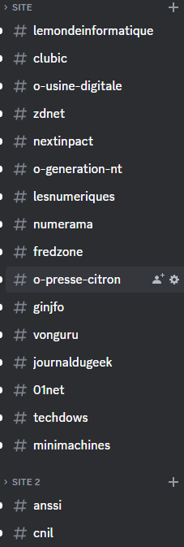
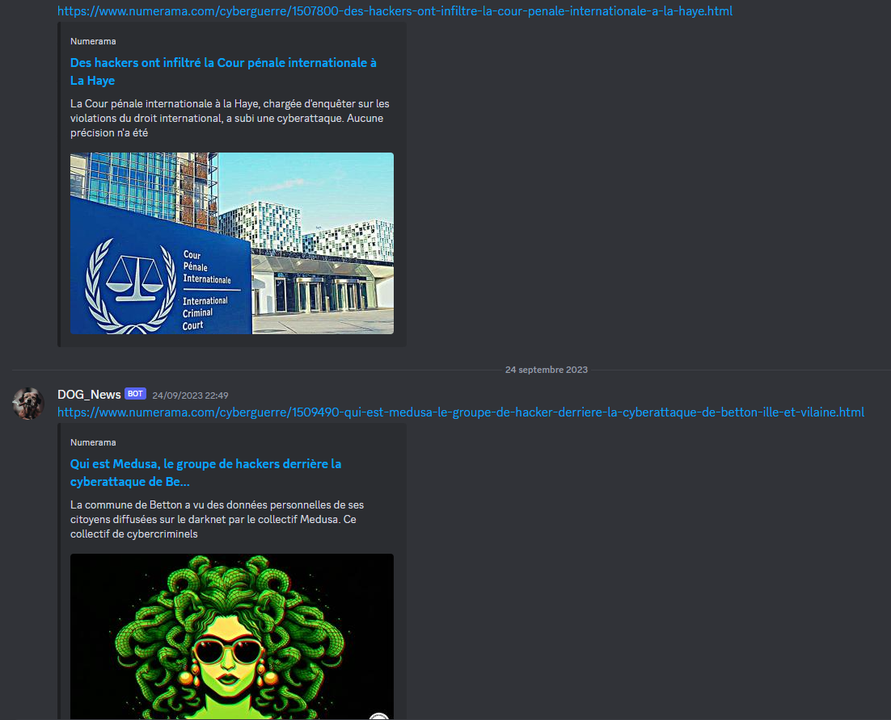

# FR
## Bot Veille
Son objectif principal est de nous tenir informé des dernières actualités en informatique (ou autre domaine).
Ce bot est configuré pour surveiller plusieurs sites web spécifiques, et lorsqu'il détecte une nouvelle actualité, il la diffuse dans trois canaux distincts : tout d'abord, dans le canal dédié au site, ensuite dans le canal correspondant à la catégorie de l'actualité, et enfin dans un canal où toutes les actualités sont répertoriées.

### Visuelle de mon bot
 
 

# EN
## Bot Veille
Its main objective is to keep us informed of the latest news in IT (or any other field).
This bot is configured to monitor several specific websites, and when it detects a new news item, it broadcasts it in three separate channels: first, in the channel dedicated to the site, then in the channel corresponding to the news category, and finally in a channel where all news items are listed.

### Visual of my bot
 
 
